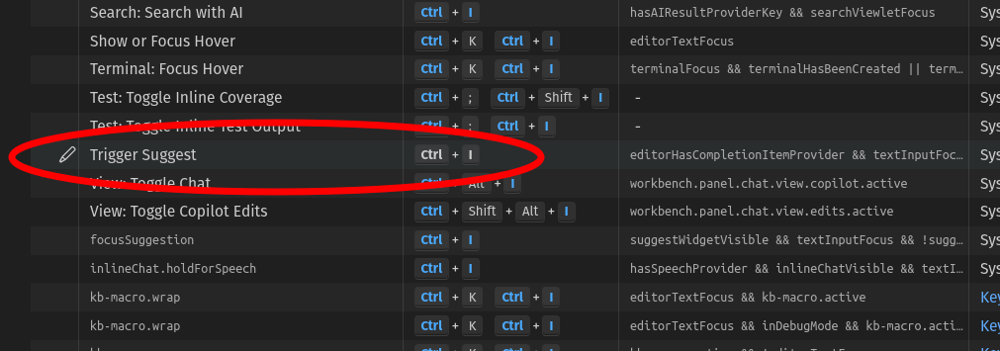

# jsxgraph-wrapper-typescript

## A thin TypeScript wrapper over JSXGraph to maximize VSCode scaffolding.

[JSXGraph](https://jsxgraph.uni-bayreuth.de/wp/index.html) is amazing for creating geometry constructions, writing games, building dashboards, and teaching coding.

But building a JSXGraph construction is finicky. JSXGraph constructions use a
single `create()` function, with over 100 overloads, requiring frequent references to the [API Reference](https://jsxgraph.org/docs/index.html) and debugging with the browser console.  There are over 1,000 attributes and methods, so you might as well keep that API Reference page open

This wrapper provides a [TypeScript](https://www.typescriptlang.org/) replacement for the `create()` function, optimized for scaffolding with VSCode.  It provides type-checking, syntax checking, and object discovery, plus completion help for most of the attributes, fields, and methods. The syntax is familiar if you already know JSXGraph, and delightful if you don't.

Visit the [TSXGraph Playground](https://cheeseandcrackers.ca/playground/) to try it out.

Don't use TypeScript?  It's still great.  Hover over the tokens of the JavaScript examples in the `JS_examples` directory.


| **JSXGraph**    | **TSXGraph** | comment |
| --------- | ------- |--------|
| `var board = JXG.JSXGraph.initBoard('jxgbox')` | `let TSX = new TSXBoard('jxgbox)`   |
| `board.create('point',[0,0])`  | `TSX.Point([0,0])`   |  // looks similar because an immediate address is always [x,y]
| `board.create('segment' , [p1, p2])`     | `TSX.Segment(p1, p2)` | // much closer to what you would expect
| `board.create('intersection', [cl,ln])` | `TSX.Intersection(cl,ln))`    |  // VSCode shows order of parameters|
| `let rot = board.create('transform', [()=>slider.Value(), c], {type: 'rotate'})`| `let rot = TSX.Rotate(()=>slider.Value(),c)` | // transform that rotates around c|
| `view.create('point3d',[0,0,0])`  | `TSX.Point3D([0,0,0])`   |  // 2D and 3D are consolidated, view is automatic


## Aarrgggg!! Copilot grabs `CTRL+I`

VSCode re-assigned `CTRL+I` to Copilot Chat.  Previously it triggered suggestions, providing instant access to JSXGraph attributes, fields, and methods. These suggestions are an essential tool for using JSXGraph.

I remapped 'Trigger Suggest' to `CTRL+J` on my machine.  It is still `CTRL+I` in the [TSXGraph Playground](https://cheeseandcrackers.ca/playground/).

To remap your machine, select File > Preferences > Keyboard Shortcuts.



## Quick Start Workflow

This package includes two quick-start workflows.  They both look for source files in the `/src` directory.


If you have a local webserver with PHP (like [XAMPP](https://www.apachefriends.org/)), then clone this directory and run...
```
npm i
tsc -w
```
Then browse to the directory you cloned. Your browser will find `index.php` there.  Add or edit `.ts` files in `/src` and refresh your browser.  If you want to use the VSCode debugger, edit the `.vscode/launch.json` file to point at your repository directory URL.


If you don't have a local webserver, run...

```
npm i
npm run start
```
Browse to `http://localhost:3000`.   Add or edit `.ts` files in `/src` and refresh your browser.  This workflow does not support the VSCode debugger.

Just want to stick to plain JavaScript?  Look at the `html_examples` directory.
\

This package includes **Space Icons** by [Good Stuff No Nonsense](https://goodstuffnononsense.com/), licensed under CC BY 4.0.
~~~
TSX.Image("icons/saturn.png",[0,0])    // Use VSCode's `Trigger Suggest` to list the icons.
~~~


## Importing TSXGraph into TypeScript

You only need to import individual elements if you are using them as TypeScript types (JavaScript doesn't need this at all).

```
import { TSXBoard, JsxMath} from './tsxgraph.js';         // always
import { Point3D, Point, Line3D } from './tsxgraph.js';   // only for types, gets fully erased
let TSX = new TSXBoard('html00')

function foo(p1: Point, p2: Point3D) {                    // example of using types
}
```
<br>
<br>


If you try the wrapper, I'd love to hear from you.

---


