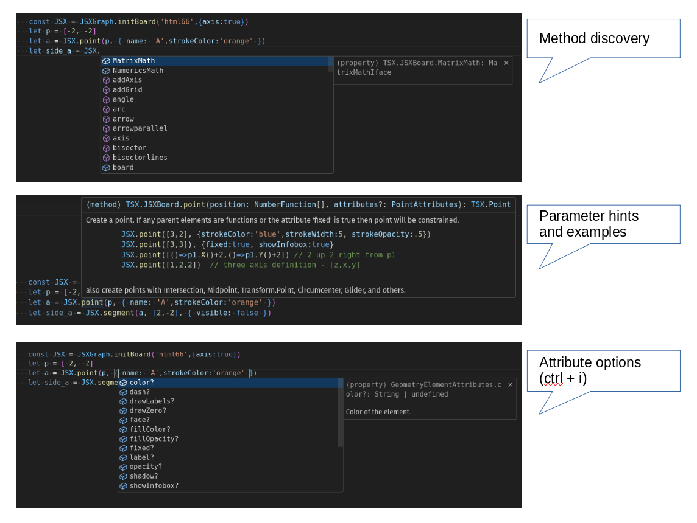
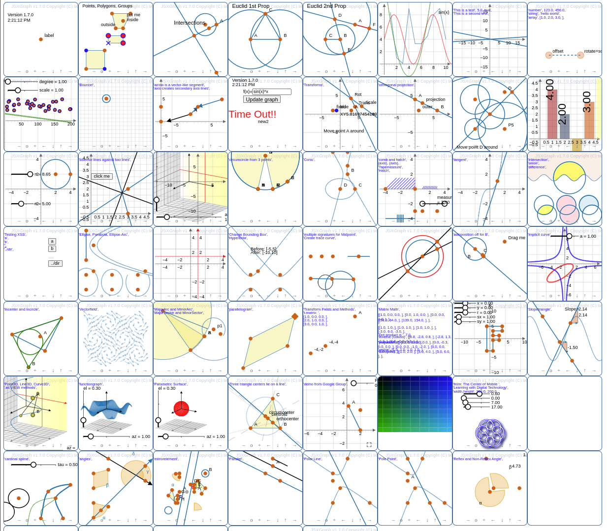

# jsxgraph-wrapper-typescript

## A thin TypeScript wrapper over JSXGraph to maximize VSCode scaffolding.

[JSXGraph](https://jsxgraph.uni-bayreuth.de/wp/index.html) is amazing for creating geometry constructions, writing games, building dashboards, and teaching coding.

But building a JSXGraph construction is finicky. JSXGraph constructions use a
single 'create()' function, with over 100 overloads, requiring frequent references to the [API Reference](https://jsxgraph.org/docs/index.html) and debugging with the browser console.

This wrapper provides a more-typical [TypeScript](https://www.typescriptlang.org/) interface, optimized for scaffolding with VSCode.  It provides type-checking, syntax checking, and object discovery, The syntax is familiar if you already know JSXGraph, and delightful if you don't.


| **JSXGraph**    | **TSXGraph** | comment |
| --------- | ------- |--------|
| `board.create('point',[0,0])`  | `TSX.Point([0,0])`   |  // looks similar because an immediate address is always [x,y]
| `board.create('segment' , [p1, p2])`     | `TSX.Segment(p1, p2)` | // much closer to what you would expect
| `board.create('intersection', [cl,ln])` | `TSX.Intersection(cl,ln))`    |  // VSCode shows order of parameters|
| `let rot = board.create('transform', [()=>slider.Value(), c], {type: 'rotate'})`| `let rot = TSX.Rotate(()=>slider.Value(),c)` | // transform that rotates around c|
| `view.create('point3d',[0,00])`  | `TSX.Point3D([0,0,0])`   |  // 2D and 3D are consolidated, view is not required


With the wrapper, VSCode offers the usual signatures, object keys, and completions.



A wrapper approach is different from providing a d.ts file. The wrapper changes the programming interface by adding a thin layer on top of JSXGraph, typically 2-3 lines per call.


## Quick Start Workflow

This package includes two quick-start workflows.  They both look for source files in the `/src` directory.

If you already have a local webserver (eg: XAMPP), then simply clone this respository, `npm i` to install the dev dependencies, `tsc -w` to compile and watch the sample programs (in the src directory), and then point your browser to the directory you have clones this repository into.

If you want to use the VSCode debugger, edit the `.vscode/launch.json` file with this directory.

If you don't have a local webserver, then clone this directory and:

```
npm i
npm run start
```
Browse to `http://localhost:3000`.   Add or edit `.ts` files in `/src` and refresh your browser.


When you are ready to move your constructions, the `.js` files you have created are in the `dist\src` directory.  If you don't want to use this workflow, just copy `tsxgraph.ts` to your own workflow.

JSXGraph is constantly evolving.  This wrapper was built around JSXGraph 1.11.


This package includes **Space Icons** by [Good Stuff No Nonsense](https://goodstuffnononsense.com/), licensed under CC BY 4.0.
~~~
TSX.Image("icons/saturn.png",[0,0])    // Use VSCode's `CTRL+I` to list the icons
~~~


If you try the wrapper, I'd love to hear from you.

---




