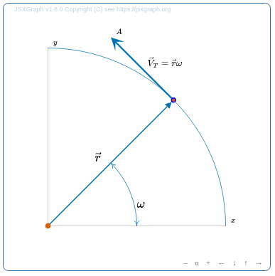

# jsxgraph-wrapper-typescript

**A thin TypeScript wrapper over JSXGraph to maximize VSCode scaffolding.**

The wrapper provides a 'TypeScript' flavor to JSXGraph syntax, providing navigation, scaffolding, syntax checking, and discovery with VSCode.

This approach is different from merely providing descriptions with a d.ts file. The wrapper changes the programming interface by adding a thin layer on top of JSXGraph, typically 2-3 lines per call.

I needed this wrapper to use JSXGraph as a graphics library for **novice** programmers.  JSXGraph is an amazing tool for writing games and learning to code.


## Already know TypeScript?  Quick Start with NPM and TSC

```
npm i jsxgraph-wrapper-typescript
npm run orbit
```
No need for Webpack or similar, just use TypeScript's TSC.  Browse orbit.ts and index.html in the `/orbit` subdirectory.  The HTML looks for the JSXGraph and KATEX libraries in `node_modules`.  Of course, webpack is fully supported, an example is included

Or... you can use plain JavaScript, and VSCode will still provide scaffolding (but not error checking). Look at `orbit.js` which was created by Typescript.  You can edit it directly with no compile step.

(24-sept-2024  I seem to get some new errors from Node's d.ts type files, just ignore.)





## Key Difference between Wrapper and JSXGraph

The vanilla JSXGraph interface offers a a single 'create()' function, with over 100 overloads.  Developing a construction involves frequent references to the [API Reference](https://jsxgraph.org/docs/index.html) and debugging with the browser console.

This wrapper provides a more-typical TypeScript interface, with each geometry element in a separate class for interactive discovery and scaffolding with VSCode.  The syntax remains familiar if you already know JSXGraph.  Here's an example.

```
    const JSX = TXG.TSXGraph.initBoard('jxgbox')
    let p = [-2, -2]
    let a = JSX.point(p, { name: 'A',strokeColor:'orange' })
    let side_a = JSX.segment(a, [2,-2], { visible: false })
```

The magic happens when using VSCode...


## Reasons NOT to Use this Wrapper

If you already know JSXGraph and are happy coding in JavaScript, this isn't for you.

The wrapper enables 95% of JSXGraph's capabilities for interactive constructions. Specialized methods and attributes not provided can mostly be accessed with the wrapper 'legacy' constructor `JSX.create(string, array, object)`.  But if you are coding with 'inside baseball' then you should use native JSXGraph.

JSXGraph is both a graphics engine and a storehouse of numerical algorithms. This wrapper is focused on graphics. I've started to add some of the Math methods, but it is a work in progress.  Also still lots of cleaning in the GeometryElement attributes and methods.

JSXGraph is constantly evolving.  This wrapper was built around JSXGraph 1.9.2/dev, and is slightly ahead of JSXGraph production.


Have fun!


