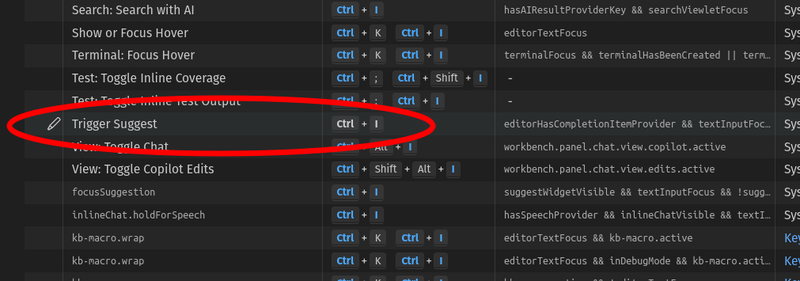

# jsxgraph-wrapper-typescript

## A thin TypeScript wrapper over JSXGraph to maximize VSCode scaffolding.

[JSXGraph](https://jsxgraph.uni-bayreuth.de/wp/index.html) is amazing for creating geometry constructions, writing games, building dashboards, and teaching coding.

But building a JSXGraph construction is finicky. JSXGraph constructions use a single `create()` function, with over 100 overloads, so VSCode can't help you with completions, signatures, or discovery.  There are over 1,000 attributes and methods.  You won't get far without the console debugger and [API Reference](https://jsxgraph.org/docs/index.html) pages open.

This wrapper provides a replacement for the `create()` function, optimized for scaffolding with VSCode.  It provides type-checking, syntax checking, completions, and object discovery.  It offers almost 100% coverage of attributes, fields, and methods. The syntax is familiar if you know JSXGraph, and delightful if you don't.

Visit the [TSXGraph Playground](https://cheeseandcrackers.ca/playground/) to try it out.

Prefer to use JavaScript?  The wrapper's `d.ts` file will still scaffold for you.  `angle.js` is an example of a JS file using the wrapper.


| **JSXGraph**    | **TSXGraph** | comment |
| --------- | ------- |--------|
| `var board = JXG.JSXGraph.initBoard('jxgbox')` | `let TSX = new TSXBoard('jxgbox)`   |
| `board.create('point',[0,0])`  | `TSX.Point([0,0])`   |  // looks similar because an immediate address is always [x,y]
| `board.create('segment' , [p1, p2])`     | `TSX.Segment(p1, p2)` | // much closer to what you would expect
| `board.create('intersection', [cl,ln])` | `TSX.Intersection(cl,ln))`    |  // VSCode shows order of parameters|
| `let rot = board.create('transform', [()=>slider.Value(), c], {type: 'rotate'})`| `let rot = TSX.Rotate(()=>slider.Value(),c)` | // transform that rotates around c|
| `view.create('point3d',[0,0,0])`  | `TSX.Point3D([0,0,0])`   |  // 2D and 3D are consolidated, view is automatic


## Quick Start Workflow

This package includes a quick-start workflows.  It looks for source files in the `/src` directory.


You require a local webserver with PHP support (like [XAMPP](https://www.apachefriends.org/)), then clone this directory and run...
```
npm i
npm run watch
```
Then browse to the directory you cloned. Your browser will find `index.php` there.  Add or edit `.ts` or `js` files in `/src` and refresh your browser.  If you want to use the VSCode debugger, edit the `.vscode/launch.json` file to point at your repository directory URL.


This package includes **Space Icons** by [Good Stuff No Nonsense](https://goodstuffnononsense.com/), licensed under CC BY 4.0.
~~~
TSX.Image("icons/saturn.png",[0,0])    // Use VSCode's `Trigger Suggest` to list the icons (see below).
~~~


## Importing TSXGraph into TypeScript

You only need to import individual elements if you are using them as TypeScript types (JavaScript doesn't need this at all).

```
import { TSXBoard, JsxMath} from './tsxgraph.js';         // always
import { Point3D, Point, Line3D } from './tsxgraph.js';   // only needed if you specify parameter or variable types

let TSX = new TSXBoard('jxgbox')                          // TSX is the wrapper
let p = TSX.Point([0,0], {name: 'origin'})                // p is a normal JSXGraph point object

function foo(p1: Point, p2: Point3D) {                    // example of using parameters types
}
```
<br>
<br>


If you try the wrapper, I'd love to hear from you.

---
---
---

## Aarrgggg!! Copilot grabs `CTRL+I`.

VSCode re-assigned `CTRL+I` to Copilot Chat.  Previously it triggered suggestions, providing instant access to JSXGraph attributes, fields, and methods. These suggestions are an essential tool for exploring JSXGraph with this wrapper.

I remapped 'Trigger Suggest' to `CTRL+J` on my machine.  It is still `CTRL+I` in the [TSXGraph Playground](https://cheeseandcrackers.ca/playground/).

To remap your machine, select File > Preferences > Keyboard Shortcuts.



